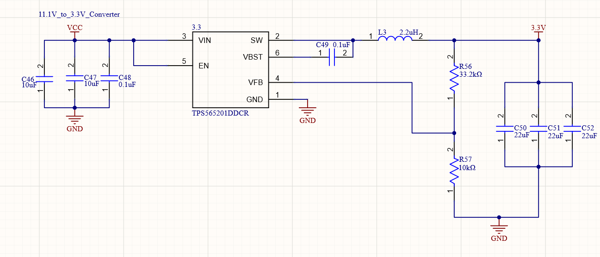
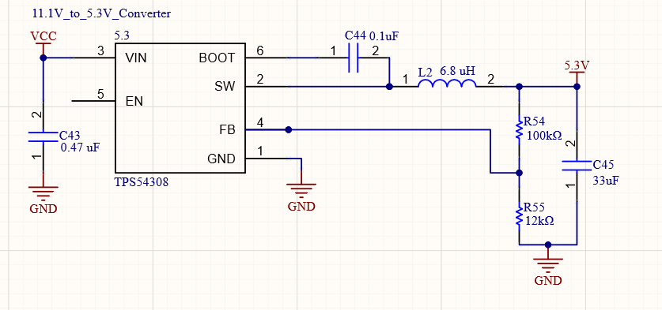
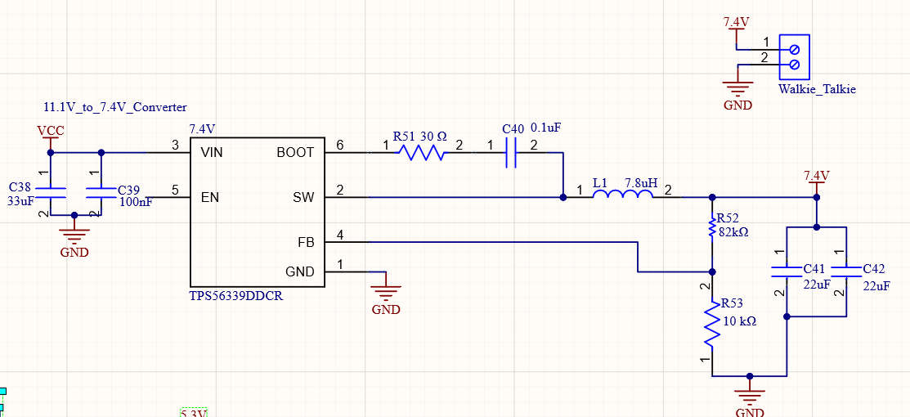
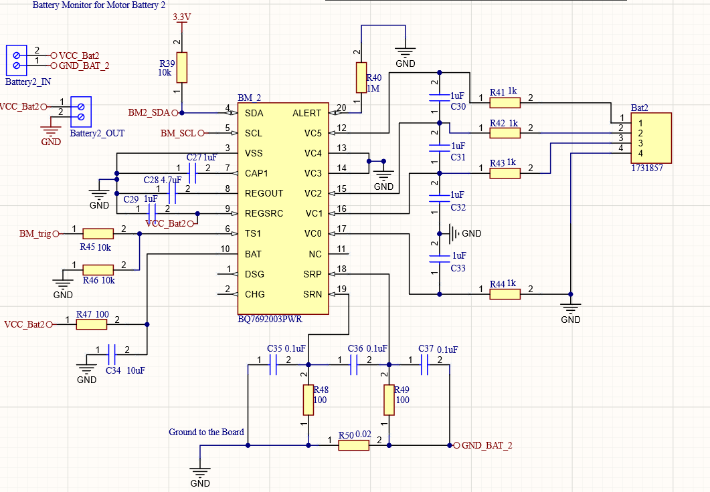

# 📡 Mobile Radio FoxBot (Senior Capstone Project)

**Duration:** Aug 2024 – May 2025  
**Team Size:** 4  
**Role:** Lead Power Board Designer & Embedded Developer  
**Tools Used:** C++, FreeRTOS, Altium Designer, I2C, ESP32, Embedded Systems

---

## 🚀 Overview

The Mobile Radio FoxBot is a battery-powered autonomous system designed for high-frequency signal tracking and mobile communication in a field environment. Amateur Radio Directional Finding (ADRF) is a sport in which an individual tries to locate a hidden transmitting device. Our goal was to develop a rover that will complete this task. Additionally, our robot will increase the potential of ARDF training and aid in the engineering of directional antennas. 

## 🛠️ Key Contributions

- **Designed a custom 4-layer power PCB** with 3 isolated power rails (3.3V, 5V, 7.4V) and 3 independent battery monitoring circuits.
- **Implemented I2C-based battery monitoring** for accurate state-of-charge reporting, reducing data error rates by 30%.
- **Used FreeRTOS with C++** to acquire and process real-time sensor data, improving system response and telemetry reliability.
- **Collaborated with a cross-functional team** to develop an autopilot system using GPS and walkie-talkie integration for remote operation.
- Conducted hardware testing and validation using oscilloscopes, logic analyzers, and custom debug firmware.

---

## 📸 Images and Schematics
### 🔋 3.3V & 5.3V Converters
|3.3V Converter | 5.3V Converter |
|---------------|---------------|
| ||

---

### 🔋 7.4V Converter
|7.4V Converter |
|---------------|
|

---
These convters each designed for specific components on the Mobile Radio FoxBot. Each of these are connected to a 3 cell Lipo battery, which operates at 11.1 V. First, the 3.3V converter for powering the ESP32. The 5.3V converter is for powering the Pixhawk, DTMF decoder, and the ultrasonic sensors. The 7.4V converter was constructed to power the Baofeng radio.
---

### 🔋 Battery Monitior
|Battery Monitior |
|---------------|
|

---
The rover was built using 3 seperate 3 cell lipo batteries. Thus there was a need for three seperate battery monitoring system for each of the batteries that will comunicate to ESP32 and have battery charge, and discharge rate avaliable.

---

### Integrated Schematics 
| File | Description |
|------|-------------|
| `main.cpp` | Main embedded firmware (FreeRTOS-based) |
