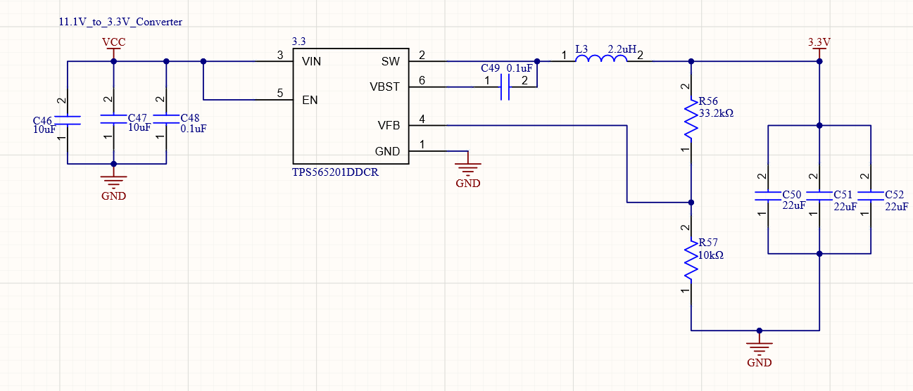
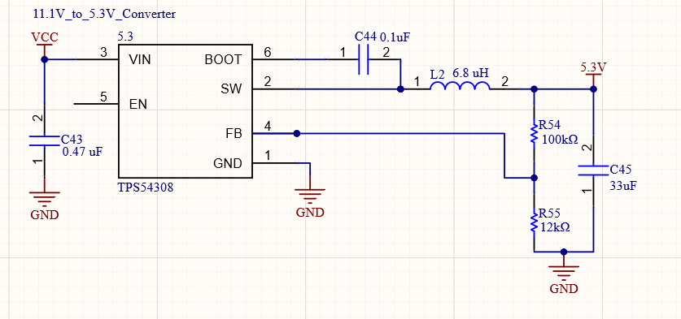
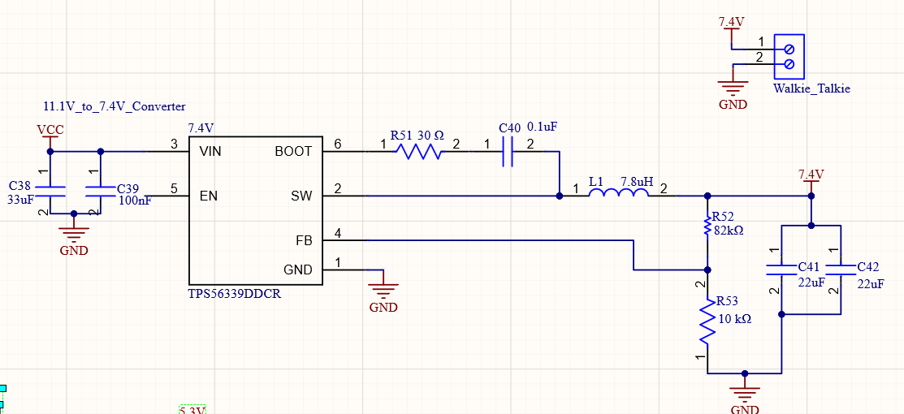
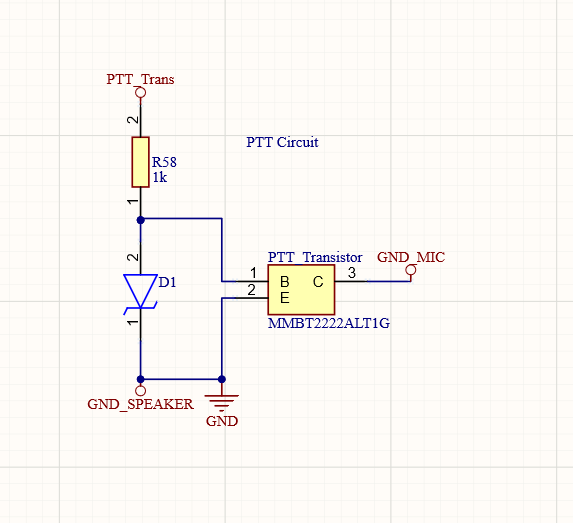
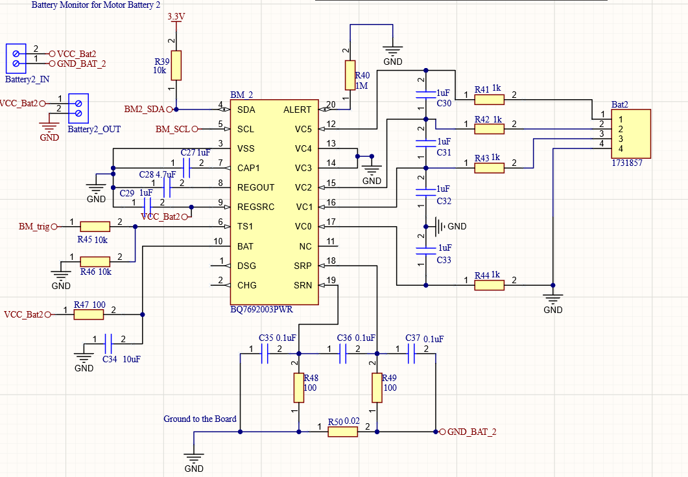
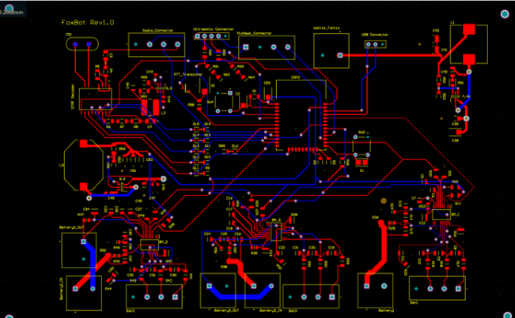
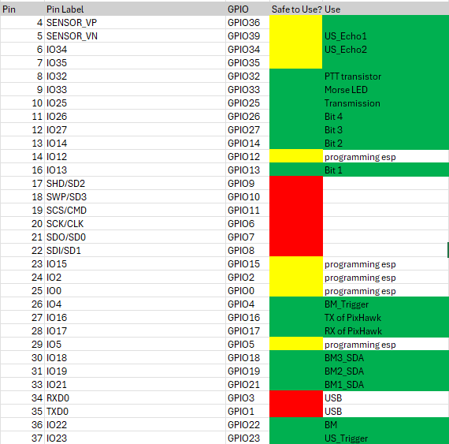
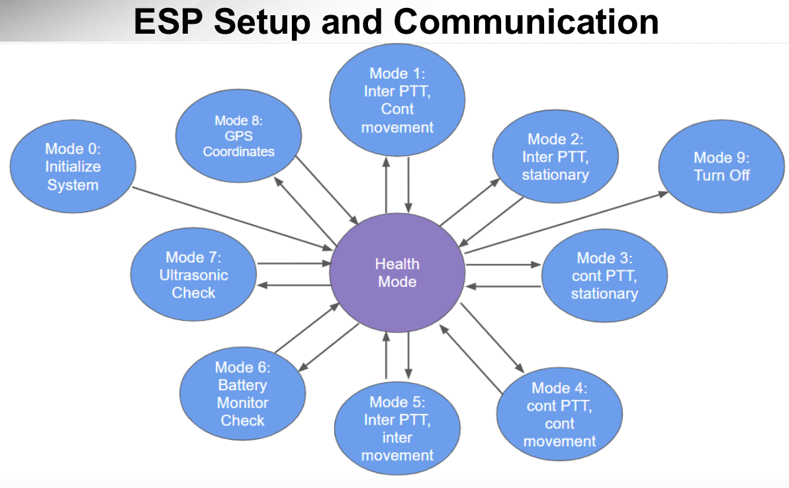

# 📡 Mobile Radio FoxBot (Senior Capstone Project)

**Duration:** Aug 2024 – May 2025  
**Team Size:** 4  
**Role:** Lead Power Board Designer & Embedded Developer  
**Tools Used:** C++, FreeRTOS, Altium Designer, I2C, ESP32, Embedded Systems

---

## 🚀 Overview

The Mobile Radio FoxBot is a battery-powered autonomous system designed for high-frequency signal tracking and mobile communication in a field environment. Amateur Radio Directional Finding (ADRF) is a sport in which an individual tries to locate a hidden transmitting device. Our goal was to develop a rover that will complete this task. Additionally, our robot will increase the potential of ARDF training and aid in the engineering of directional antennas. 

## 🛠️ Key Contributions

- **Designed a custom 4-layer power PCB** with 3 isolated power rails (3.3V, 5V, 7.4V) and 3 independent battery monitoring circuits.
- **Implemented I2C-based battery monitoring** for accurate state-of-charge reporting, reducing data error rates by 30%.
- **Used FreeRTOS with C++** to acquire and process real-time sensor data, improving system response and telemetry reliability.
- **Collaborated with a cross-functional team** to develop an autopilot system using GPS and walkie-talkie integration for remote operation.
- Conducted hardware testing and validation using oscilloscopes, logic analyzers, and custom debug firmware.

---

## 📸 Images and Schematics
| 3.3V Converter| 5.3V Converter|
|---------------|---------------|
| ||

---

| 7.4V Converter| Push to Talk Circuit |
|---------------|---------------|
||

---

These convters each designed for specific components on the Mobile Radio FoxBot. Each of these are connected to a 3 cell Lipo battery, which operates at 11.1 V. First, the 3.3V converter for powering the ESP32. The 5.3V converter is for powering the Pixhawk, DTMF decoder, and the ultrasonic sensors. The 7.4V converter was constructed to power the Baofeng radio. The push to talk schematic was used so that the ESP32 could control when the push to talk is on or off on the Baofeng Radio, this was important for establishing communication between user and rover. This was done using the ground of the speaker and microphone and connecting them via a transistor. Then have the speaker connected to a DAC pin on the ESP32.

---

### 🔋 Battery Monitior
|Battery Monitior |
|---------------|
|

---
The rover was built using 3 seperate 3 cell lipo batteries. Thus there was a need for three seperate battery monitoring system for each of the batteries that will comunicate to ESP32 and have battery charge, and discharge rate avaliable.

---

## 📘 Integrated Schematics

| File | Description |
|------|-------------|
| [`IntegratedSchematic_v1.SchDoc`](./Altium_Files/IntegratedSchematic_v1.SchDoc) | Altium Designer Integrated Schematic File |

---
This file contains all the shcematics that are required for the rover, this has all the integrated schematics.

## PCB Design
| Image|
|---------------|
|
|---------------|
|

| File | Description |
|------|-------------|
| [`PCB1.PcbDoc`](./Altium_Files/PCB1.PcbDoc) | Altium Designer Integrated PCB File |
| [`Schematic_Library.SchLib`](./Altium_Files/Schematic_Library.SchLib) | Altium Designer Schematic Library |
| [`PCB_Library.PcbLib`](./Altium_Files/PCB_Library.PcbLib) | Altium Designer PCB Library |
| [`CapStone_BOM.xlsx`](./Altium_Files/CapStone_BOM.xlsx) | Bill of Materials for PCB |

---

## 📸 ESP32 Programming
The ESP32 played an essintial part in the Mobile Radio Foxbot. I began by setting up the general flow that the program will follow. Because our communication is via Baofeng radio I established the Push to Talk control as seen in the [PTT Schemaitc](#-Images-and-Schematics). Then, having the DTMF decoder outputing bits in binary to the pins of the ESP32 this would allow the ESP to understand the signal being sent to the Foxbot. 

## 📡 ESP Setup and Communication — Mode Diagram

This diagram outlines the **mode control logic** for an embedded ESP-based system used in the Mobile Radio FoxBot project. The system operates using multiple modes driven by health checks, sensor inputs, and remote commands via Push-to-Talk (PTT) communication. At the center is `Health Mode`, which monitors the system's state and directs transitions between modes based on mission context and internal diagnostics.

---

### 🔄 Mode Descriptions

| Mode | Description |
|------|-------------|
| **Mode 0** | Initialize System — Starts up and initializes hardware, communication protocols, and sensor systems. |
| **Mode 1** | Intermittent PTT, Continuous Movement — The robot moves continuously and listens intermittently for PTT input. |
| **Mode 2** | Intermittent PTT, Stationary — Robot stays still while occasionally listening for PTT signals. |
| **Mode 3** | Continuous PTT, Stationary — Stationary mode with constant monitoring of PTT input. |
| **Mode 4** | Continuous PTT, Continuous Movement — Continuous motion with constant PTT signal listening. |
| **Mode 5** | Intermittent PTT, Intermittent Movement — Alternates between moving and listening to PTT input. |
| **Mode 6** | Battery Monitor Check — Runs diagnostics to check battery status and performance. |
| **Mode 7** | Ultrasonic Check — Uses ultrasonic sensors to detect and respond to nearby obstacles. |
| **Mode 8** | GPS Coordinates — Acquires or transmits GPS data for position tracking or navigation. |
| **Mode 9** | Turn Off — Shuts down the system safely. |

---

### 🧠 Health Mode as Central Control

The `Health Mode` functions as the core of the finite state machine (FSM), continuously monitoring battery status, sensor activity, GPS positioning, and communication signals. It determines the appropriate operational mode and ensures the system responds safely and effectively under changing conditions. If an error or degraded performance is detected, Health Mode transitions the system to a safe or reduced-functionality state (e.g., stop movement, conserve power).

| File | Description |
|------|-------------|
| [`FoxBotCode_Morse_BatMont.c`](./ProgramFiles/FoxBotCode_Morse_BatMont.c) | Code for Foxbot implementation |

### ✅ Project Outcome & Success Summary

This project was a **comprehensive success**, fulfilling all functional, technical, and performance objectives outlined at the start of the Mobile Radio FoxBot capstone initiative. Our system was designed to operate in a variety of real-world scenarios where autonomous movement, health monitoring, and remote communication are essential. By the end of the development cycle, the system was not only functional but also highly reliable, modular, and adaptable to future extensions.

All **mode functionalities**—from initialization, remote control via Push-to-Talk (PTT), and movement logic, to health diagnostics, GPS-based tracking, and safe system shutdown—were fully implemented. Each operational mode was validated through extensive field testing, with real-time data acquisition, sensor integration, and dynamic transitions all functioning smoothly. Notably, the `Health Mode` proved to be a key innovation, acting as a centralized state manager that continuously monitored internal systems (such as battery levels and ultrasonic sensors) and made intelligent decisions about mode transitions. This design significantly improved system fault tolerance and helped prevent runtime errors or hardware failures in live environments.

The embedded system was programmed in C++ using FreeRTOS, enabling multitasking for concurrent processes like sensor polling, GPS data parsing, and communication. We successfully implemented I2C-based battery monitoring and integrated GPS data collection for autonomous positioning. PTT communication protocols were developed to enable voice-activated or radio-based remote commands, adding flexibility and range to the system’s control.

Additionally, our custom-designed PCB for the power board operated as intended, distributing power to all subsystems with protection and efficiency. All hardware modules—including microcontrollers, sensors, and communication interfaces—were integrated into a clean and compact system architecture that followed best practices for embedded system design.

The final prototype demonstrated:
- **Seamless execution of 10 distinct operating modes**
- **Stable runtime behavior over extended field sessions**
- **Modular code structure for easy testing and debugging**
- **Reliable data flow between sensors, microcontrollers, and communication interfaces**

Through collaborative teamwork, clear documentation, and rigorous testing, this project represents a strong example of end-to-end engineering design. It reflects our ability to design, build, and deliver a production-level embedded system under real-world constraints. The project also provided invaluable experience in hardware-software integration, systems thinking, and agile development practices.

